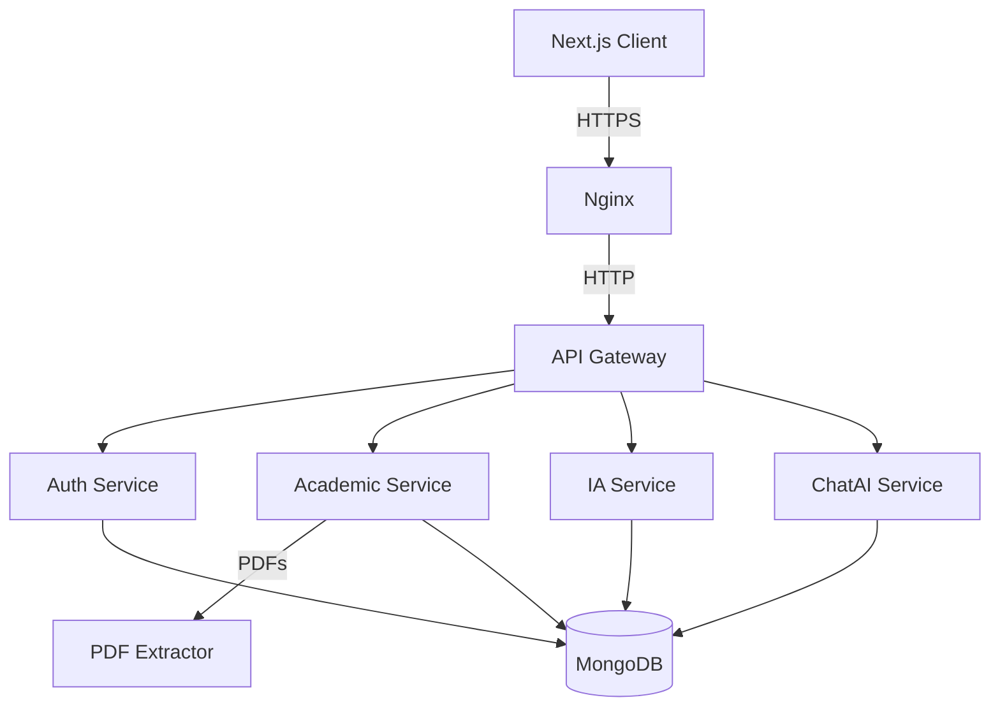

# 🎓 EduPlatform

**EduPlatform** is a next-generation Educational Management System (EMS) designed to bridge the gap between administrators, teachers, students, and parents. Powered by advanced AI (Groq), it offers personalized learning insights, document analysis, and seamless communication.


*Note: Replace with actual screenshot*

## 🚀 Key Features

*   **👥 Role-Based Access Control (RBAC):** Dedicated portals for Superadmins, Admins, Teachers, Students, and Parents.
*   **🤖 AI-Powered Analysis:**
    *   **Personalized Recommendations:** analyzing student performance to suggest improvements.
    *   **Chat AI:** Interactive tutor for students.
*   **📚 Academic Management:**
    *   **Course & Grade Tracking:** Centralized management of curriculum and assessment.
    *   **Document Repository:** Secure upload and sharing of course materials.
*   **📄 PDF Intelligence:** Automatic extraction and content analysis of uploaded PDF documents.
*   **🔒 Enterprise-Grade Security:**
    *   Microservices architecture.
    *   Secure Authentication (JWT + Bcrypt).
    *   Production-ready deployment (Nginx, SSL, UFW, Fail2Ban).

---

## 🛠️ Technology Stack

### **Frontend**
*   **Framework:** [Next.js 15](https://nextjs.org/) (App Router)
*   **Language:** TypeScript
*   **Styling:** TailwindCSS, Lucide React
*   **State/Network:** Axios

### **Backend (Microservices)**
| Service | Tech Stack | Description |
| :--- | :--- | :--- |
| **Api Gateway** | Node.js / Express | Central entry point, routing, and checking basic auth tokens. |
| **Auth Service** | Node.js / Express | User authentication, registration, and role management. |
| **Academic Service** | Node.js / Express | Core logic for courses, grades, and document metadata. |
| **IA Service** | Python / FastAPI | AI logic using **Groq**, generating insights and recommendations. |
| **ChatAI Service** | Python / FastAPI | Real-time chat interface logic for AI tutoring. |
| **PDF Extractor** | Python / Flask | Specialized service for parsing and extracting text from PDFs. |

### **Infrastructure & Database**
*   **Database:** MongoDB Atlas (NoSQL)
*   **Containerization:** Docker & Docker Compose
*   **Web Server:** Nginx (Reverse Proxy & SSL Termination)
*   **Security:** Let's Encrypt (Certbot), UFW, Fail2Ban

---

## 🏗️ Architecture

The application follows a **Microservices Architecture**. Requests from the client are sent to the **API Gateway**, which routes them to the appropriate internal service.



---

## 💻 Getting Started (Local Development)

Follow these steps to run the application on your local machine.

### Prerequisites
*   Node.js (v18+)
*   Docker & Docker Compose
*   Git

### 1. Clone the Repository
```bash
git clone https://github.com/SamiBouhraoua/EduPlatform.git
cd EduPlatform
```

### 2. Configure Environment Variables
You need to create `.env` files for each service.
*(See `docker-compose.local.yml` for required variables)*

**Example `.env` structure:**
*   `services/auth-service/.env` : `MONGO_URI`, `JWT_SECRET`
*   `services/ia-service/.env`: `GROQ_API_KEY`, etc.
*   `client/.env.local`: `NEXT_PUBLIC_API_URL=http://localhost:80/api`

### 3. Run with Docker
Use the local compose file to start the stack:
```bash
docker compose -f docker-compose.local.yml up -d --build
```

### 4. Access the App
*   **Frontend:** [http://localhost:3000](http://localhost:3000)
*   **API Gateway:** [http://localhost:4000](http://localhost:4000)

---

## 🌍 Deployment (VPS)

The project includes a production-ready `docker-compose.yml` with Nginx configuration.

**Deploy Command:**
```bash
# On your secure VPS
git pull
docker compose up -d --build
```

**Security Checklist:**
*   [x] Firewall (UFW) active (Ports 22, 80, 443 only).
*   [x] Fail2Ban shielding SSH.
*   [x] SSL Certificates generated via Certbot.
*   [x] Secrets managed via `.env` files (not committed to Git).

---

## 🤝 Contributing

1.  Fork the repository.
2.  Create your feature branch (`git checkout -b feature/AmazingFeature`).
3.  Commit your changes (`git commit -m 'Add some AmazingFeature'`).
4.  Push to the branch (`git push origin feature/AmazingFeature`).
5.  Open a Pull Request.

---

## 📄 License

Distributed under the MIT License. See `LICENSE` for more information.
